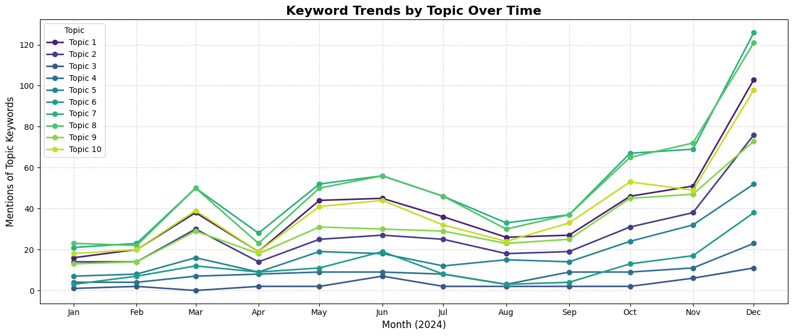
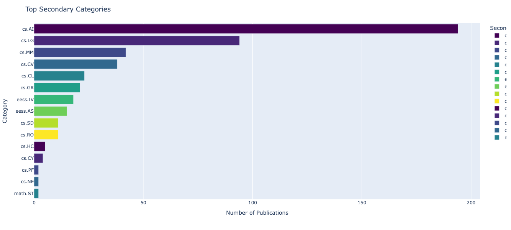

# arXiv 2024 Trend Analysis: Video Generation & Beyond

This project explores publication trends on [arXiv.org](https://arxiv.org/) in **2024**, with a focus on **video generation**, author collaboration patterns, keyword evolution, and research topic modeling.

## Overview

Using the `arxiv` Python API, we scrape and analyze recent publications related to video generation, including:
- Topic modeling with **NMF** and interactive topic–keyword graphs
- Monthly keyword trends by topic
- Co-authorship networks (top authors, video-generation researchers, etc.)
- Category-wise publication insights
- Word cloud generation and text preprocessing

## Structure

```bash
├── arXiv_2024.ipynb                # Main notebook with all code & visualizations
├── graphs/
│   ├── topic_graph_interactive.html         # Pyvis: Topic–Keyword Graph
│   ├── coauth_top_all_topics.html           # Co-author Network (Top Authors)
│   ├── coauth_top_video_generation.html     # Co-author Network (Top Video Authors)
│   └── coauth_50_video_generation.html      # Co-author Network (Top 50 in Video Gen)
└── data/ 
    └── *.csv files 
```

## Key Visuals

- **Interactive Topic Graph**  
  → `graphs/topic_graph_interactive.html`

- **Co-Authorship Networks**  
  → Top authors: `coauth_top_all_topics.html`  
  → Top video authors: `coauth_top_video_generation.html`  
  → Top 50 in video generation: `coauth_50_video_generation.html`

- **Keyword Trends Over Time**  
  

- **Top Secondary Categories**  
  

## Methods Used

- `NMF` for topic modeling from TF-IDF matrices
- `matplotlib`, `seaborn`, `plotly` for static & interactive plots
- `networkx` + `pyvis` for graph visualizations
- `WordCloud` for summary insights
- Data wrangling with `pandas` and regex-based cleaning

## Requirements

Install dependencies via:

```bash
pip install -r requirements.txt
```

Main packages:
- `arxiv`
- `scikit-learn`
- `matplotlib`, `seaborn`, `pyvis`
- `networkx`, `wordcloud`, `pandas`

## Future Ideas

- Fine-grained **temporal clustering** of topics
- Predictive modeling of keyword evolution
- Embedding-based topic exploration (e.g., `BERTopic`)

## License

MIT License © 2024 — *[Pineappledeydre]*
```
